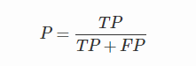
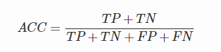
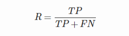
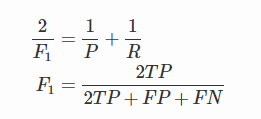

# 11. 精确率(precision)和召回率(recall)

<iframe src="https://ghbtns.com/github-btn.html?user=geektutu&repo=interview-questions&type=star&count=true&size=large" frameborder="0" scrolling="0" width="160px" height="30px"></iframe>

混淆矩阵

- True Positive(真正, TP)：将正类预测为正类数.
- True Negative(真负 , TN)：将负类预测为负类数.
- False Positive(假正, FP)：将负类预测为正类数 → 误报 (Type I error).
- False Negative(假负 , FN)：将正类预测为负类数 → 漏报 (Type II error).

精确率(precision)定义为：

需要注意的是精确率(precision)和准确率(accuracy)是不一样的，

在正负样本不平衡的情况下，准确率这个评价指标有很大的缺陷。比如在互联网广告里面，点击的数量是很少的，一般只有千分之几，如果用acc，即使全部预测成负类（不点击）acc 也有 99% 以上，没有意义。

召回率(recall,sensitivity,true positive rate)定义为：

此外，还有`F1`值，是精确率和召回率的调和均值，

精确率和准确率都高的情况下，`F1`值也会高。