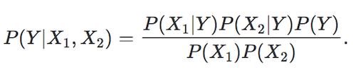

# 13. 朴素贝叶斯分类某个类别概率为0怎么办

<iframe src="https://ghbtns.com/github-btn.html?user=geektutu&repo=interview-questions&type=star&count=true&size=large" frameborder="0" scrolling="0" width="160px" height="30px"></iframe>

## 题目

A1,A2,A3是三个特征，Y是分类结果。A1,A2,A3和Y 均只有0和1两种情况。

|A1|A2|A3|Y|
|:---:|:---:|:---:|:---:|
|1|1|0|1|
|0|1|1|1|
|1|0|1|0|
|0|1|0|0|
|0|0|1|0|

### 1. 朴素贝叶斯（Naive Bayes）为什么朴素？

朴素贝叶斯中的“朴素”二字突出了这个算法的简易性。

朴素贝叶斯的简易性表现该算法基于一个很朴素的假设：所有的变量都是相互独立的。用贝叶斯定理可以写成



但是在很多情况下，所有变量两两之间独立，这几乎是不可能的。

> 举个例子：
> Y = 这个人是否是举重运动员。
> X1 = 性别，X2 = 这个人能否举起100公斤的箱子。
> 变量X1和X2显然不是独立的。

换句话说，朴素贝叶斯的独立性假设很傻很天真，所以预测精度往往不是很高。

### 2. `1,0,0` 的分类结果是什么？


> 分母都是相同，所以只计算分子即可。

```python
P(Y=0) = 3/5
P(Y=1) = 2/5
P(Y=0|A1=1,A2=0,A3=0) = 3/5 * 1/3 * 2/3 * 1/3 = 2/45
P(Y=1|A1=1,A2=0,A3=0) = 2/5 * 1/2 * 1/4 * 1/2 = 1/40
```

> 答： **分类结果为0**

## 结论

从上题可以看出，当每个类别未出现导致概率为0时，可以采用贝叶斯估计的方式来解决。当训练集较多的情况下，可以生成一个接近于0的概率代替0，接近于p的概率代替p，几乎不影响原有的先验概率分布。

贝叶斯估计公式中，常取λ为1，这时称之为拉普拉斯平滑（Laplace smoothing）。

上例仅对先验概率为0的特征采用了贝叶斯估计，一般情况下会对所有参与训练的特征都采用贝叶斯估计。