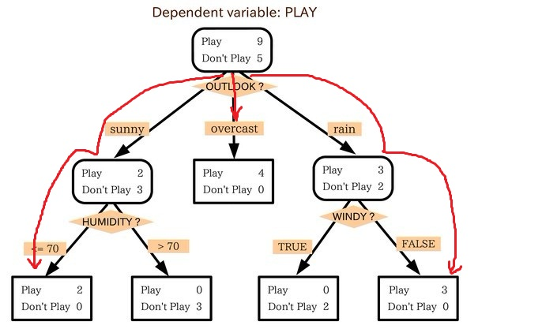
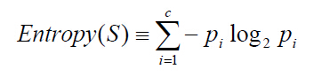
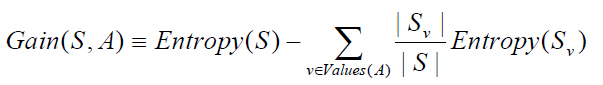
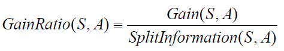

# 14. 决策树

<iframe src="https://ghbtns.com/github-btn.html?user=geektutu&repo=interview-questions&type=star&count=true&size=large" frameborder="0" scrolling="0" width="160px" height="30px"></iframe>

## 什么是决策树

决策树(decision tree)是一种基本的分类与回归方法。决策树是用样本的属性作为结点，用属性的取值作为分支的树结构。 

决策树的根结点是所有样本中信息量最大的属性。树的中间结点是该结点为根的子树所包含的样本子集中信息量最大的属性。决策树的叶结点是样本的类别值。决策树是一种知识表示形式，它是对所有样本数据的高度概括决策树能准确地识别所有样本的类别，也能有效地识别新样本的类别。

## 特征选择

|ID|年龄|有工作|有自己的房子|信贷情况|类别(是否个给贷款)|
|:---:|:---:|:---:|:---:|:---:|:---:|
|1|青年|否|否|一般|否|
|2|青年|否|否|好|否|
|3|青年|是|否|好|是|
|4|青年|是|是|一般|是|
|5|青年|否|否|一般|否|
|6|中年|否|否|一般|否|
|7|中年|否|否|好|否|
|8|中年|是|是|好|是|
|9|中年|否|是|非常好|是|
|10|中年|否|是|非常好|是|
|11|老年|否|是|非常好|是|
|12|老年|否|是|好|是|
|13|老年|是|否|好|是|
|14|老年|是|否|非常好|是|
|15|老年|否|否|一般|否|

信息熵（entropy）是用来衡量一个随机变量出现的期望值。如果信息的不确定性越大，熵的值也就越大，出现的各种情况也就越多。

信息增益（information gain）是指信息划分前后的熵的变化，也就是说由于使用这个属性分割样例而导致的期望熵降低。也就是说，信息增益就是原有信息熵与属性划分后信息熵（需要对划分后的信息熵取期望值）的差值，具体计算法如下：

## ID3算法

决策树算法ID3的基本思想：

首先找出最有判别力的属性，把样例分成多个子集，每个子集又选择最有判别力的属性进行划分，一直进行到所有子集仅包含同一类型的数据为止。最后得到一棵决策树。

J.R.Quinlan的工作主要是引进了信息论中的信息增益，他将其称为信息增益（information gain），作为属性判别能力的度量，设计了构造决策树的递归算法。

ID3算法：

	1.对当前例子集合，计算各属性的信息增益；
	2.选择信息增益最大的属性Ak；
	3.把在Ak处取值相同的例子归于同一子集，Ak取几个值就得几个子集；
	4.对既含正例又含反例的子集，递归调用建树算法；
	5.若子集仅含正例或反例，对应分枝标上P或N，返回调用处。

## C4.5算法
C4.5算法是ID3算法的一种改进。

改进
- 用信息增益率来选择属性，克服了用信息增益选择属性偏向选择多值属性的不足
- 在构造树的过程中进行剪枝
- 对连续属性进行离散化
- 能够对不完整的数据进行处理

信息增益率

设样本集S按离散属性F的c个不同的取值划分为c个子集，则这c个子集的信息熵为：

信息增益率是信息增益与信息熵的比例，如下：

## CART