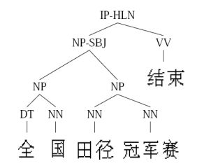

# 6. 监督学习和无监督学习

<iframe src="https://ghbtns.com/github-btn.html?user=geektutu&repo=interview-questions&type=star&count=true&size=large" frameborder="0" scrolling="0" width="160px" height="30px"></iframe>

## 关键区别

**是否有监督（supervised），就看输入数据是否有标签（label）。输入数据有标签，则为（有）监督学习，没标签则为无监督学习。**
### 知乎的通俗回答

作者：王丰
[链接](https://www.zhihu.com/question/23194489/answer/25028661)

首先看什么是学习（learning）？一个成语就可概括：举一反三。此处以高考为例，高考的题目在上考场前我们未必做过，但在高中三年我们做过很多很多题目，懂解题方法，因此考场上面对陌生问题也可以算出答案。机器学习的思路也类似：我们能不能利用一些训练数据（已经做过的题），使机器能够利用它们（解题方法）分析未知数据（高考的题目）？

最简单也最普遍的一类机器学习算法就是分类（classification）。对于分类，输入的训练数据有特征（feature），有标签（label）。所谓的学习，其本质就是找到特征和标签间的关系（mapping）。这样当有特征而无标签的未知数据输入时，我们就可以通过已有的关系得到未知数据标签。

在上述的分类过程中，如果所有训练数据都有标签，则为有监督学习（supervised learning）。如果数据没有标签，显然就是无监督学习（unsupervised learning）了，也即聚类（clustering）。目前分类算法的效果还是不错的，但相对来讲，聚类算法就有些惨不忍睹了。确实，无监督学习本身的特点使其难以得到如分类一样近乎完美的结果。这也正如我们在高中做题，答案（标签）是非常重要的，假设两个完全相同的人进入高中，一个正常学习，另一人做的所有题目都没有答案，那么想必第一个人高考会发挥更好，第二个人会发疯。

这时各位可能要问，既然分类如此之好，聚类如此之不靠谱，那为何我们还可以容忍聚类的存在？因为在实际应用中，标签的获取常常需要极大的人工工作量，有时甚至非常困难。例如在自然语言处理（NLP）中，Penn Chinese Treebank在2年里只完成了4000句话的标签……

这时有人可能会想，难道有监督学习和无监督学习就是非黑即白的关系吗？有没有灰呢？Good idea。灰是存在的。二者的中间带就是半监督学习（semi-supervised learning）。对于半监督学习，其训练数据的一部分是有标签的，另一部分没有标签，而没标签数据的数量常常极大于有标签数据数量（这也是符合现实情况的）。隐藏在半监督学习下的基本规律在于：数据的分布必然不是完全随机的，通过一些有标签数据的局部特征，以及更多没标签数据的整体分布，就可以得到可以接受甚至是非常好的分类结果。（此处大量忽略细节）

因此，learning家族的整体构造是这样的：

- 有监督学习（分类，回归）
- ↕
- 半监督学习（分类，回归），transductive learning（分类，回归）
- ↕
- 半监督聚类（有标签数据的标签不是确定的，类似于：肯定不是xxx，很可能是yyy）
- ↕
- 无监督学习（聚类）

## 概念
### 监督学习
通过已有的训练样本（即已知数据以及其对应的输出）来训练，从而得到一个最优模型，再利用这个模型将所有新的数据样本映射为相应的输出结果，对输出结果进行简单的判断从而实现分类的目的，那么这个最优模型也就具有了对未知数据进行分类的能力。

监督学习最常见的就是：分类（classification）&回归（regression）

### 无监督学习
输入数据没有被标记，也没有确定的结果。样本数据类别未知，需要根据样本间的相似性对样本集进行分类（聚类，clustering）试图使类内差距最小化，类间差距最大化。通俗点将就是实际应用中，不少情况下无法预先知道样本的标签，也就是说没有训练样本对应的类别，因而只能从原先没有样本标签的样本集开始学习分类器设计。

无监督学习最常见的就是：聚类（Clustering）

无监督学习举例：
- 新闻分类

