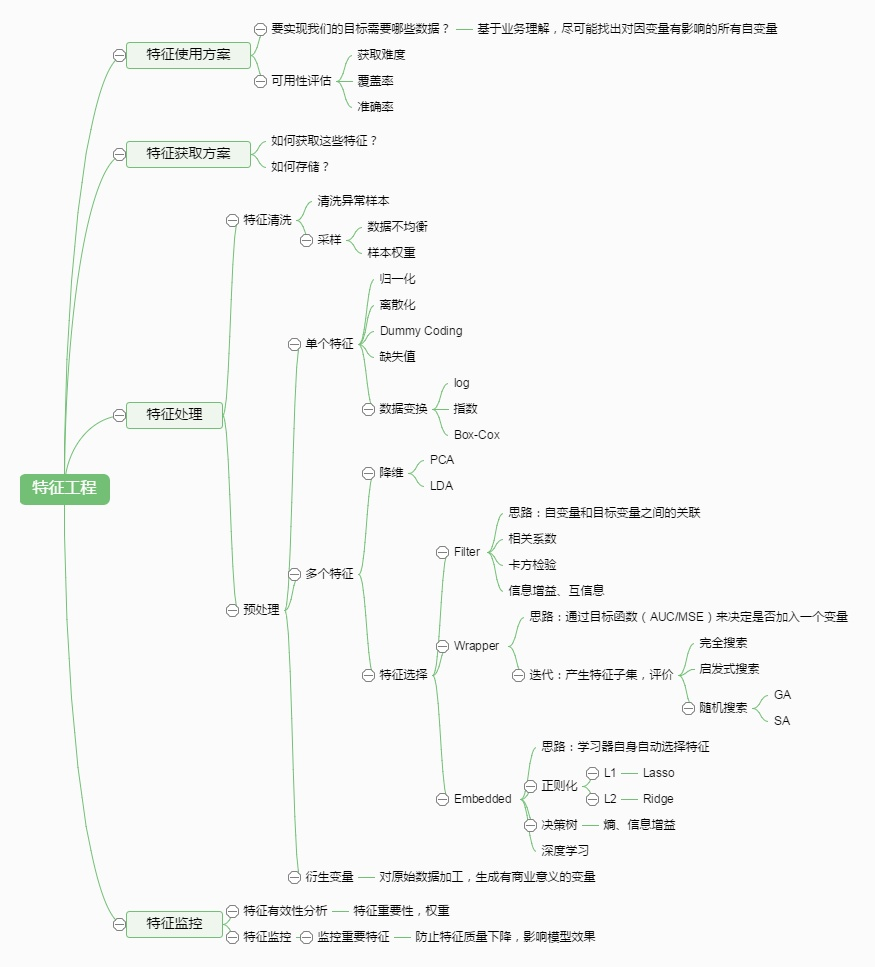

# 8. 数据清洗与特征处理

<iframe src="https://ghbtns.com/github-btn.html?user=geektutu&repo=interview-questions&type=star&count=true&size=large" frameborder="0" scrolling="0" width="160px" height="30px"></iframe>

## 数据清洗
清洗标注数据，主要是数据采样和样本过滤

**数据采样**

数据采样，例如对于分类问题：选取正例，负例。对于回归问题，需要采集数据。对于采样得到的样本，根据需要，需要设定样本权重。当模型不能使用全部的数据来训练时，需要对数据进行采样，设定一定的采样率。采样的方法包括随机采样，固定比例采样等方法。

**样本过滤**

1.结合业务情况进行数据的过滤，例如去除crawler抓取，spam，作弊等数据。

2.异常点检测，采用异常点检测算法对样本进行分析，常用的异常点检测算法包括：

- 偏差检测，例如聚类，最近邻等。
- 基于统计的异常点检测算法
例如极差，四分位数间距，均差，标准差等，这种方法适合于挖掘单变量的数值型数据。全距(Range)，又称极差，是用来表示统计资料中的变异量数(measures of variation) ，其最大值与最小值之间的差距；四分位距通常是用来构建箱形图，以及对概率分布的简要图表概述。
- 基于距离的异常点检测算法，主要通过距离方法来检测异常点，将数据集中与大多数点之间距离大于某个阈值的点视为异常点，主要使用的距离度量方法有绝对距离 ( 曼哈顿距离 ) 、欧氏距离和马氏距离等方法。
- 基于密度的异常点检测算法，考察当前点周围密度，可以发现局部异常点，例如LOF算法

## 特征处理

### 特征处理与分析

在对特征进行分类后，下面介绍下对特征常用的处理方法。包括1.特征归一化，离散化，缺省值处理。2.特征降维方法。3.特征选择方法等。

特征归一化，离散化，缺省值处理
主要用于单个特征的处理。

**归一化**

不同的特征有不同的取值范围，在有些算法中，例如线性模型或者距离相关的模型像聚类模型、knn模型等，特征的取值范围会对最终的结果产生较大影响，例如二元特征的取值范围为[0，1]，而距离特征取值可能是[0，正无穷)，在实际使用中会对距离进行截断，例如[0，3000000]，但是这两个特征由于取值范围不一致导致了模型可能会更偏向于取值范围较大的特征，为了平衡取值范围不一致的特征，需要对特征进行归一化处理，将特征取值归一化到［0，1］区间。常用的归一化方法包括1.函数归一化，通过映射函数将特征取值映射到［0，1］区间，例如最大最小值归一化方法，是一种线性的映射。还有通过非线性函数的映射，例如log函数等。2.分维度归一化，可以使用最大最小归一化方法，但是最大最小值选取的是所属类别的最大最小值，即使用的是局部最大最小值，不是全局的最大最小值。3.排序归一化，不管原来的特征取值是什么样的，将特征按大小排序，根据特征所对应的序给予一个新的值。

**离散化**

在上面介绍过连续值的取值空间可能是无穷的，为了便于表示和在模型中处理，需要对连续值特征进行离散化处理。常用的离散化方法包括等值划分和等量划分。等值划分是将特征按照值域进行均分，每一段内的取值等同处理。例如某个特征的取值范围为[0，10]，我们可以将其划分为10段，[0，1)，[1，2)，...，[9，10)。等量划分是根据样本总数进行均分，每段等量个样本划分为1段。例如距离特征，取值范围［0，3000000］，现在需要切分成10段，如果按照等比例划分的话，会发现绝大部分样本都在第1段中。使用等量划分就会避免这种问题，最终可能的切分是[0，100)，[100，300)，[300，500)，..，[10000，3000000]，前面的区间划分比较密，后面的比较稀疏。

**缺省值处理**

有些特征可能因为无法采样或者没有观测值而缺失，例如距离特征，用户可能禁止获取地理位置或者获取地理位置失败，此时需要对这些特征做特殊的处理，赋予一个缺省值。缺省值如何赋予，也有很多种方法。例如单独表示，众数，平均值等。

### 参考
[https://tech.meituan.com/machinelearning-data-feature-process.html](https://tech.meituan.com/machinelearning-data-feature-process.html)