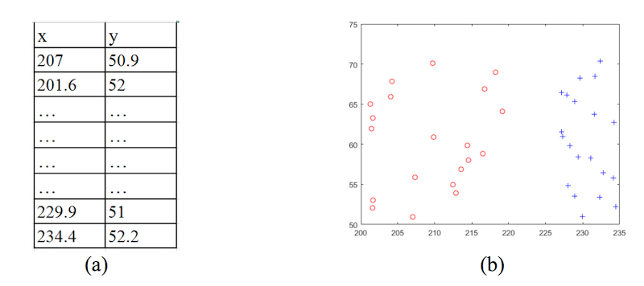
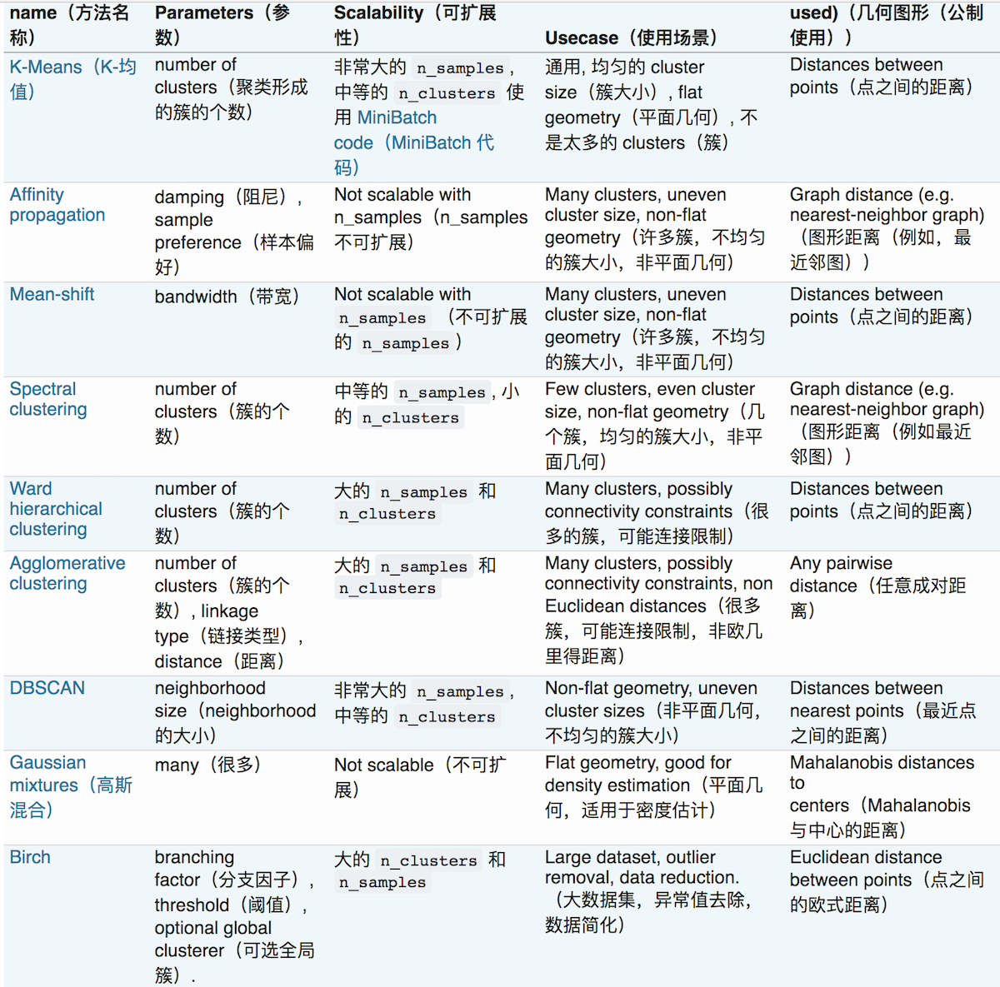

# 9. 猜测这种划分最可能是什么聚类算法的结果

<iframe src="https://ghbtns.com/github-btn.html?user=geektutu&repo=interview-questions&type=star&count=true&size=large" frameborder="0" scrolling="0" width="160px" height="30px"></iframe>

## 以下是各个算法的比较

## 各个聚类算法比较的Python代码

[python代码链接](https://github.com/geektutu/interview-questions/tree/master/ipynb/sklearn-cluster-compare.ipynb)

> 最可能是KMean算法