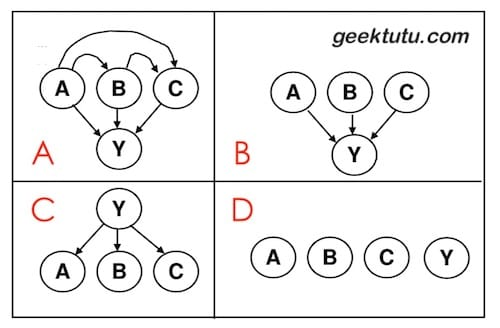
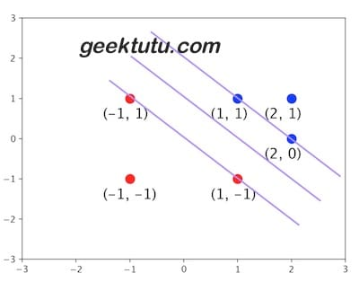
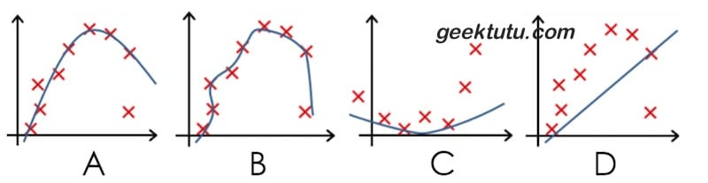

<p style="color:red">声明：所有习题系博主花费大量精力整理，请尊重劳动成果，禁止转载。</p>

**机器学习(machine learning)深度学习(deep learning)**
**面试笔试题(interview questions)/课程课后考试习题解答**
**[机器学习笔试面试题汇总](https://geektutu.com/post/qa-ml.html)，[Github](https://github.com/geektutu/interview-questions)**

## Q1 决策树

使用决策树分类时，如果输入的某个特征的值是连续的，通常使用二分法对连续属性离散化，即根据是否大于/小于某个阈值进行划分。如果采用多路划分，每个出现的值都划分为一个分支，这种方式的最大问题是：

- A 计算量太大
- B 训练集和测试集表现都很差
- C 训练集表现良好，测试集表现差
- D 训练集表现差，测试集表现良好

<details>
<summary>答案</summary>
<div>

**C** 连续值通常采用二分法，离散特征通常采用多路划分的方法，但分支数不宜过多。
连续特征每个值都划分为一个分支，容易过拟合，泛化能力差，导致训练集表现好，测试集表现差。
</div>
</details>

## Q2 朴素贝叶斯

输入属性是 A, B, C，输出属性是 Y。若使用朴素贝叶斯分类(Naive Bayes Classifier)，下面哪张图能表示朴素贝叶斯分类的假设。



<details>
<summary>答案</summary>
<div>

**C** 朴素贝叶斯分类器是机器学习一个特别质朴而深刻的模型：当要根据多个特征而非一个特征对数据进行分类时，假设这些特征相互独立，然后利用条件概率乘法法则得到每一个分类的概率，选择概率最大的那个作为输出。

回顾一下贝叶斯公式 P(Y|A,B,C) = P(A,B,C|Y) * P(Y) / P(A,B,C)，如果需要求在A,B,C条件下Y的概率，则需要知道先验概率P(A,B,C)和P(Y)，和在Y条件下，A,B,C的概率。
</div>
</details>

## Q3 神经网络

对神经网络(neural network)而言，哪一项对过拟合(overfitting)和欠拟合(underfitting)影响最大。

- A 隐藏层节点(hidden nodes)数量
- B 学习速率(learning rate)
- C 初始权重
- D 每一次训练的输入个数固定

<details>
<summary>答案</summary>
<div>

**A** 过拟合和欠拟合与神经网络的复杂程度有关，模型越大越容易过拟合。隐藏层节点数量直接决定了模型的大小与复杂程度。
</div>
</details>

## Q4 回归

对多项式回归(polynomial regression)而言，哪一项对过拟合(overfitting)和欠拟合(underfitting)影响最大。

- A 多项式的度(polynomial degree)
- B 是否通过矩阵求逆/梯度下降学习权重
- C 高斯噪声方差(variance of the Gaussian noise)
- D 每一次训练的输入个数固定

<details>
<summary>答案</summary>
<div>

**A** 多拟合/欠拟合与模型复杂度有关，和模型复杂度最相关的是多项式的度。举一个极端的例子，度为1，则是线性回归，y=kx+b，一条直线分类，很容易欠拟合。那度比较大时，则能表示更为复杂的曲线，容易过拟合。
</div>
</details>

## Q5 特征缩放

特征缩放(feature scaling)的作用？

- A 降低每次迭代计算成本加速梯度下降
- B 防止陷入局部最优
- C 加快了标准方程(Normal Equation)的求解
- D 相同的训练效果迭代次数更少，从而加速了梯度下降。

<details>
<summary>答案</summary>
<div>

**D** 如果某个特征比其他特征值大得多，则需要付出额外的迭代成本。因此训练前，进行特征缩放可以避免额外的迭代，快速达到预期效果。最常用的方法，比如归一化。将所有的特征的值缩放到0-1之间。
</div>
</details>

## Q6 SVM

在下面的二元标签数据集上训练线性支持向量机(Support Vector Machine, SVM)模型

```bash
+：(-1, 1), (1, -1), (-1, -1)
-：(1, 1), (2, 0), (2, 1)
```

请问，这个模型中的支持向量是哪些？

- A (-1, 1), (1, 1), (2, 1) 
- B (-1, 1), (-1, -1), (2, 1) 
- C (-1, 1), (1, -1), (1, 1), (2,0)

<details>
<summary>答案</summary>
<div>



**C** 先将坐标点画出来，问自己一个问题，是不是所有的点对于分割线的位置起决定性作用？

其实在特别远的区域，无论增加多少个样本点，也不会影响分割线的位置，因为分割线是由几个关键点决定的（图上四个），这几个关键点支撑起了一个分割超平面，这四个关键点，就是支持向量。
</div>
</details>

## Q7 过拟合

下列哪个模型过拟合(Overfit)了。



<details>
<summary>答案</summary>
<div>

**B** 拟合曲线紧跟数据集且复杂很高，表明过度拟合了训练集。
</div>
</details>

## Q8 误差

经验误差(empirical error)与泛化误差(generalization error)分别指？

<details>
<summary>答案</summary>
<div>

- 经验误差: 也叫训练误差(training error)，模型在训练集上的误差。
- 泛化误差: 模型在新样本集(测试集)上的误差。
</div>
</details>

## Q9 交叉验证

简述 K折交叉验证(k-fold crossValidation)。

<details>
<summary>答案</summary>
<div>

- 数据集大小为N，分成K份，则每份含有样本N/K个。每次选择其中1份作为测试集，另外K-1份作为训练集，共K种情况。
- 在每种情况中，训练集训练模型，用测试集测试模型，计算模型的泛化误差。
- 将K种情况下，模型的泛化误差取均值，得到模型最终的泛化误差。
</div>
</details>

## Q10 类别不平衡

如何处理数据中的“类别不平衡”？例如二分类问题，训练集中80%分类为A，20%分类为B。

<details>
<summary>答案</summary>
<div>

- **简单方法**
    - 数据多的欠采样(under-sampling)，舍弃一部分数据，使其与较少类别的数据相当。
    - 数据少的过采样(over-sampling)，即重复使用一部分数据，使其与较多类别的数据相当。
    - 阈值调整（threshold moving，例如数据均衡时，阈值为0.5，那么可以按比例，例如调整到 0.8。

- **复杂方法**
    - 数据采样过程中，生成并插样“少数类别”数据，代表算法 SMOTE 和 ADASYN。
    - 数据先聚类，“多数类别”随机欠采样，“少数类别”数据生成。
    - 随机欠采样容易丢失重要信息，可结合集成学习欠采样，代表算法：EasyEnsemble。利用集成学习机制，将大类划分为若干个集合供不同的学习器使用。相当于对每个学习器欠采样，避免全局丢失重要信息。

</div>
</details>

## 附：题目主要来源

- [Machine Learning exam - CMU](http://www.cs.cmu.edu/~tom/10701_sp11/prev.shtml)
- [Andrew Ng - coursera](https://www.coursera.org/learn/machine-learning)