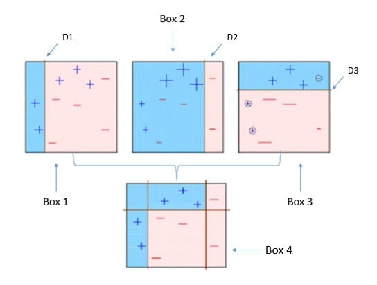

声明：所有习题系博主花费大量精力整理，请尊重劳动成果，禁止转载。

**机器学习(machine learning)深度学习(deep learning)**
**面试笔试题(interview questions)/课程课后考试习题解答**
**[机器学习笔试面试题汇总](https://geektutu.com/post/qa-ml.html)，[Github](https://github.com/geektutu/interview-questions)**

## Q11 - 皮尔逊相关系数

两个变量的 Pearson 相关性系数为零，但这两个变量的值同样可以相关？

- A 正确   
- B 错误

答案

**A** Pearson相关系数只能衡量线性相关性，但无法衡量非线性关系。如y=x^2，x和y有很强的非线性关系。

在数据标准化后，Pearson相关性系数、余弦相似(Cosine相似度)、欧式距离的平方可认为是等价的。这三种方法都是用来度量线性相关性的。

参考：[如何理解皮尔逊相关系数（Pearson Correlation Coefficient） - 知乎](https://www.zhihu.com/question/19734616)

 

## Q12 - 信息熵

计算变量 [0,0,1,1,1] 的信息熵。

- A -(3/5 log(3/5) + 2/5 log(2/5))
- B 3/5 log(3/5) + 2/5 log(2/5)
- C 2/5 log(3/5) + 3/5 log(2/5)
- D 3/5 log(2/5) – 2/5 log(3/5)

答案

**A**，公式：H(X) = -sum(p(xi) * log(p(xi))) (i = 1, 2, 3, ... , n)

香农的信息熵本质上是对“不确定现象”的数学化度量。

例如，如果我们用1代表下雨，0代表不下雨。[0,0,1,1,1]代表有 3/5 的概率下雨，信息熵是 0.97；而 [1,1,1,1,1] 代表100%的概率下雨，信息熵是 -1 * log(5/5) = 0。

完全确定的事件，信息熵为0；信息熵越大，代表不确定性越大。

参考：[信息熵是什么？- 知乎](https://www.zhihu.com/question/22178202)

## Q13 - 数据归一化

数据预处理阶段，对数值特征归一化或标准化，理论上不会对哪种模型产生很大影响。

- A 决策树
- B k-means
- C kNN

答案

**A** k-means和kNN(k-NearestNeighbor)都需要使用距离。而决策树对于数值特征，只在乎其大小排序，而非绝对大小。不管是标准化或者归一化，都不会影响数值之间的相对大小。

## Q14 - 神经网络

某个神经网络的激活函数是 ReLU，若使用线性激活函数代替 ReLU，那么该神经网络还能表征异或(XNOR)函数吗？

- A 可以
- B 不可以

答案

**B** 线性激活函数不能解决非线性问题，异或(XNOR)关系是非线性的。

常用的非线性激活函数有：sigmoid，tanh，softplus，Relu。

其中 Relu 的函数表达式为：y = max(0, x)

## Q15 - Batch

机器学习训练时，Mini-Batch 的大小优选为2的幂，如 64 或 128，原因是？

- A 设置为偶数，梯度下降算法训练更快
- B GPU 对2的幂次的 batch 可以发挥更佳的性能，利于并行化处理
- C 设置为奇数，损失函数不稳定

答案

**B** 

## Q16 - 降维

下列不属于降维算法的是？

- A 主成分分析(Principal Component Analysis，PCA)
- B 线性判别分析(Linear Discriminant Analysis, LDA)
- C 逻辑回归(Logistic Regression, LR)

答案

**C** PCA 和 LDA 都是常用的降维算法。LDA作用于带标签数据，PCA作用于无标签数据。

LDA的原理是，将带上标签的数据（点），通过投影的方法，投影到维度更低的空间中，使得投影后的点，会形成按类别区分，一簇一簇的情况，相同类别的点，将会在投影后的空间中更接近。

PCA的原理是，通过正交变换将一组可能存在相关性的变量转换为一组线性不相关的变量，转换后的这组变量叫主成分。

参考：[主成分分析](https://zh.wikipedia.org/wiki/%E4%B8%BB%E6%88%90%E5%88%86%E5%88%86%E6%9E%90)

## Q17 - 曼哈顿距离&欧式距离

计算 (1, 3), (4, 7) 的曼哈顿距离(L1距离)和欧氏距离(L2距离)

答案

L1：|1-4| + |3-7| = 7
L2: sqrt((1-4)^2 + (3-7)^2) = 5

## Q18 - 召回率和准确率

召回率(Recall)和准确率 (Precision)的区别。

答案

准确率和召回率是广泛用于信息检索和统计学分类领域的两个度量值，用来评价结果的质量。其中精度是检索出相关文档数与检索出的文档总数的比率，衡量的是检索系统的查准率；召回率是指检索出的相关文档数和文档库中所有的相关文档数的比率，衡量的是检索系统的查全率。

简而言之：

召回率 (Recall)：正样本有多少被找出来了（**召回了多少**）。
准确率 (Precision)：你认为的正样本，有多少猜对了（**猜的准确性如何**）。

举个例子：1000辆卡车，5辆有质量问题。选取了其中10辆，其中有3辆有质量问题。那么找到有质量问题的卡车的准确率为 3/10，召回率为 3/5。

参考：[如何解释召回率与准确率？ - 知乎](https://www.zhihu.com/question/19645541)

## Q19 - Boosting

简介Boosting方法原理。 

图片来源：[A Quick Guide to Boosting in ML - Medium](https://medium.com/greyatom/a-quick-guide-to-boosting-in-ml-acf7c1585cb5)

答案

boosting算法是一类将弱学习器提升为强学习器的集成学习算法，它通过改变训练样本的权值，学习多个分类器，并将这些分类器进行线性组合，提高泛化性能。

先介绍一下“强学习”和“弱学习”的概念：一个分类，如果存在一个多项式算法能够学习他，并得到很高的正确率，那么这个算法称为强学习器，反之如果正确率只是稍大于随机猜测（50%），则称为弱学习器。在实际情况中，我们往往会发现弱学习器比强学习器更容易获得，所以就有了能否把弱学习器提升（boosting）为强学习器的疑问。于是提升类方法应运而生，它代表了一类从弱学习器出发，反复训练，得到一系列弱学习器，然后组合这些弱学习器，构成一个强学习器的算法。大多数boost方法会改变数据的概率分布（改变数据权值），具体而言就是提高前一轮训练中被错分类的数据的权值，降低正确分类数据的权值，使得被错误分类的数据在下轮的训练中更受关注；然后根据不同分布调用弱学习算法得到一系列弱学习器实现的，再将这些学习器线性组合，具体组合方法是误差率小的学习器会被增大权值，误差率大的学习器会被减小权值，典型代表adaboost算法。

## Q20 - 随机森林

随机森林的随机性体现在哪里？

答案

随机森林是一个包含多个决策树的分类器，并且其输出的类别是由个别树输出的类别的众数而定。随机森林的随机性体现在每颗树的训练样本是随机的，树中每个节点的分裂属性集合也是随机选择确定的。有了这2个随机的保证，随机森林就不会产生过拟合的现象了。

 随机森林是用一种随机的方式建立的一个森林，森林是由很多棵决策树组成的，每棵树所分配的训练样本是随机的，树中每个节点的分裂属性集合也是随机选择确定的。

参考：[独家 | 一文读懂随机森林的解释和实现 - 知乎](https://zhuanlan.zhihu.com/p/51165358)

